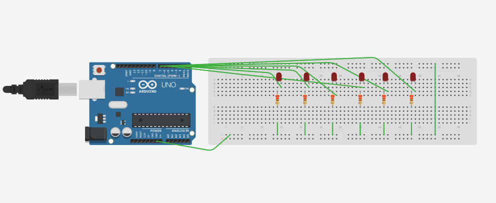

# 6 LED Snake Pattern using Arduino

This project demonstrates interfacing six LEDs with Arduino UNO
and generating a snake (running light) pattern using Tinkercad.

## Components Used
- Arduino UNO
- 6 LEDs
- 6 × 220Ω resistors
- Breadboard

## Working
LEDs turn ON and OFF sequentially creating a snake pattern.

## Tinkercad Link
https://www.tinkercad.com/things/flZ02HiTP9u-arduino-6-led-snake-pattern
