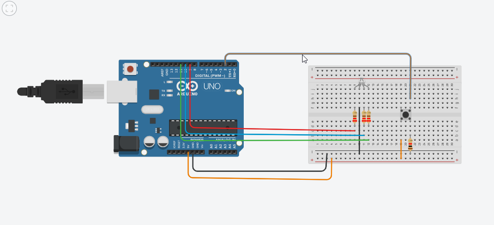

# RGB LED with Push Button
[view-tinkercad](https://www.tinkercad.com/things/4hvDgiI7pBQ-assignment-3?sharecode=u533hPkMBRHDK5Kp31cbZVyOKmHDVrFTY24Wk2-4Ev8)

## Objective

Interface an RGB LED with Arduino UNO and control colors using a push button.

## Components

Arduino UNO, RGB LED (Common Cathode), Push Button,
3 × 220Ω resistors, 10kΩ resistor, Breadboard, Jumper wires.

## Working

1 Press → Red ON

2 Press → Blue ON

3 Press → Green ON

4 Press → Reset (All OFF)

The button press count changes the LED color using digital input and output logic.

